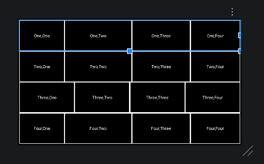
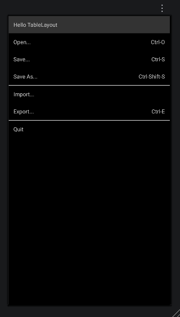
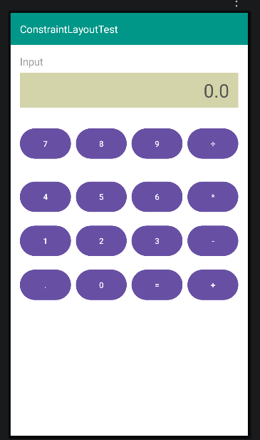
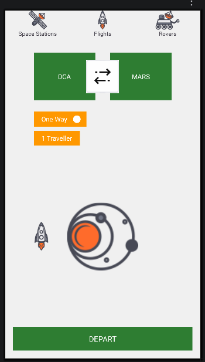

# Android 界面布局实验（任务1-4）

## 👨‍🎓 学生信息
- **姓名**：洪凯翔
- **学号**：121052024058
- **班级**：软工二班

## 📖 项目简介
本项目为 Android 界面布局实验，涵盖了传统 XML 布局的四个典型任务。通过实践，掌握了 `LinearLayout`（线性布局）、`TableLayout`（表格布局）和 `ConstraintLayout`（约束布局）的核心用法与区别。

---

## 🚀 任务展示

### 任务1：利用线性布局实现 4x4 网格界面
**效果展示：**

**核心思路**：
外层使用垂直的 `LinearLayout`，内层嵌套 4 个水平的 `LinearLayout`。通过将 `layout_height` 和 `layout_width` 设为 `0dp`，并配合 `layout_weight`（权重）属性，实现了 4 行 4 列在屏幕中的均匀分布。

### 任务2：利用表格布局实现菜单界面
**效果展示：**

**核心思路**：
使用 `TableLayout` 作为根布局，通过 `android:stretchColumns="1"` 让第二列（快捷键区域）自动拉伸。每一行使用 `TableRow` 包裹，并在标题行使用了 `layout_span="2"` 实现跨列居中。按钮的右对齐使用了 `android:gravity="right"`。

### 任务3：利用约束布局实现计算器界面
**效果展示：**

**核心思路**：
全部使用 `ConstraintLayout` 实现，完全放弃了嵌套布局。将各个按钮和显示框通过上下左右约束（`layout_constraintXXX_toYYYOf`）进行定位。同一行按钮通过设置宽度为 `0dp` 并配合 `layout_constraintHorizontal_weight="1"` 实现了等宽分布。

### 任务4：利用约束布局实现自由排列界面
**效果展示：**

**核心思路**：
深入应用了 `ConstraintLayout` 的相对定位和层级覆盖（Z轴）特性。解决了双箭头需要“浮”在两个绿色方块之上重叠的问题，以及各个图片和圆点的对齐问题。

---

## 💡 遇到的问题与解决方案

在本次实验过程中，我遇到了一些技术难题并成功解决：

1. **LinearLayout 宽度分配问题**
    - **问题**：在任务1中，最初将 TextView 的宽度设为 `0dp` 并结合 `weight="1"`，导致所有格子等宽，无法还原效果图中文字长短不一导致的宽度差异。
    - **解决**：了解了 `wrap_content` 与 `layout_weight` 搭配使用的方式，让基础宽度根据内容自适应，系统再将剩余空间按权重分配，实现了完美的效果。

2. **ConstraintLayout 控件重叠（浮动）问题**
    - **问题**：在任务4中，想让白色的双箭头“浮”在两个绿色方块上面，但最初被约束限制在了两个方块中间的空白区域，无法重叠。
    - **解决**：通过调整约束关系（跨越式约束）或使用 `-margin`（负边距）强制控件向两侧延伸，并利用 XML 代码书写顺序（写在后面的图层在上方）实现了完美的浮动覆盖效果。

3. **Git 仓库误传 `.idea` 文件夹**
    - **问题**：第一次向 GitHub 提交代码时，不小心将 Android Studio 本地的 `.idea` 配置文件提交了上去，导致仓库混乱。
    - **解决**：在终端中使用 `git rm -r --cached .idea` 命令，清除了 Git 对该文件夹的追踪，并在后续的新项目中配置了完善的 `.gitignore` 文件。

4. **Gradle 下载与 GitHub 网络连接超时**
    - **问题**：国内网络环境导致 Gradle 下载频繁失败（UnknownHostException），且推送代码到 GitHub 时经常遇到 `Recv failure: Connection was reset`。
    - **解决**：通过将 `gradle-wrapper.properties` 中的下载源替换为腾讯云镜像（`mirrors.cloud.tencent.com`），解决了构建问题；通过配置代理端口或使用手机热点，解决了 Git 推送的网络阻断问题。

---

## 🎓 实验心得
通过本次实验，我不仅掌握了 Android 传统 UI 布局的三大法宝，更深刻理解了“嵌套布局会导致性能下降”这一原则。在排查环境和网络问题的过程中，也锻炼了独立解决开发环境配置问题的能力，为后续学习更现代的 UI 框架打下了坚实基础。